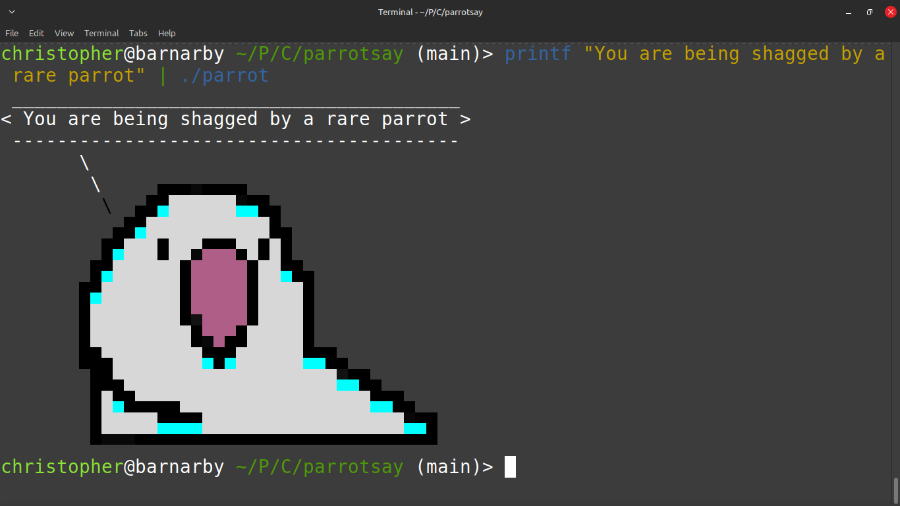

# Parrot

A program that parrots back whatever you tell it.

Parrot is an imperfect implementation of the cowsay program written in C which prints parrots rather than cows. Parrot reads from stdin and echos the result back to the termainal while wrapped inside a text bubble. A randomly coloured parrot is also printed along with the text.

The parrot in question is Sirocco, a member of the critically endangered Kākāpō species that inspired the [The Cult of the Party Parrot](https://cultofthepartyparrot.com/) after he tried to [mate with zoologist Mark Carwardine](https://www.youtube.com/watch?v=9T1vfsHYiKY)

Parrot accepts one option, `-w`, which configures the width of the text balloon. This is more a suggestion as line breaks occur at spaces and don't
happen within the middle of words.



## Requirements

* (gnu) make
* A version of gcc or clang that supports c11
* A (*)nix based operating system.

## Installation

To install parrot you can run the following commands

```sh
git clone https://github.com/chrisBirmingham/parrot
cd parrot
make
[sudo] make install
```

By default, the makefile installs to /usr/local/bin. This can be overridden
with the `PREFIX` variable

```sh
make install PREFIX=~/.local
```

## Inspiration/Attributions

* [Cowsay](https://github.com/tnalpgge/rank-amateur-cowsay)
* Sirocco and the Cult of the Party Parrot
* The C implementation of wordwrap found [here](https://rosettacode.org/wiki/Word_wrap) which started as the springboard for my implementation.
